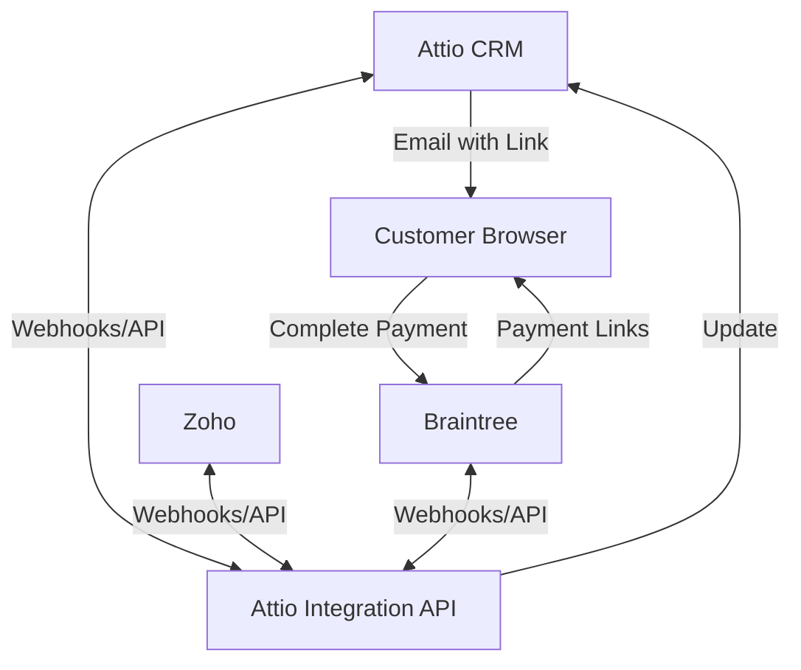
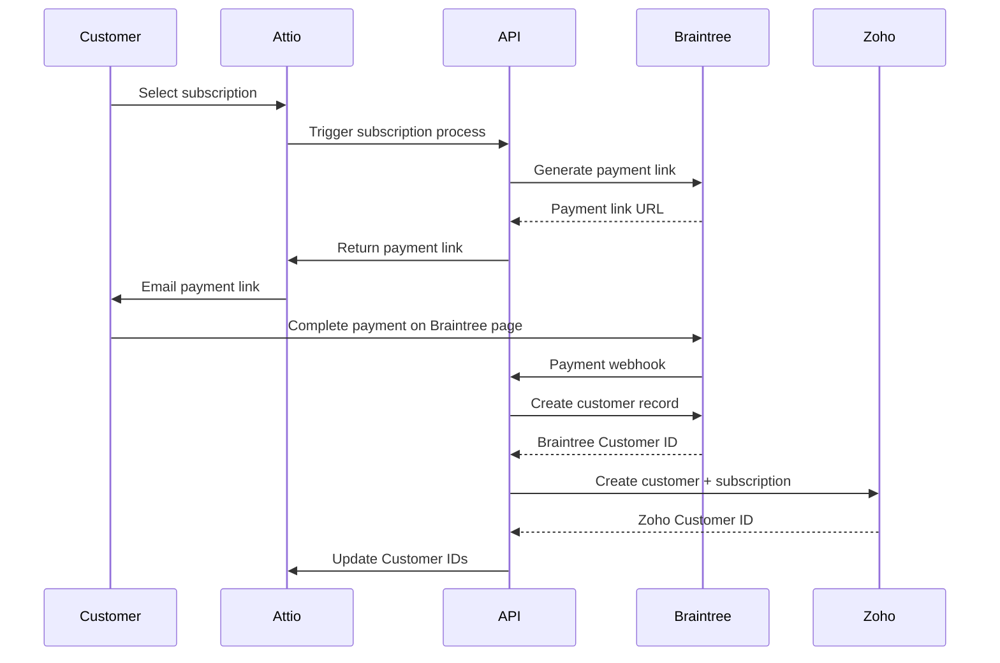
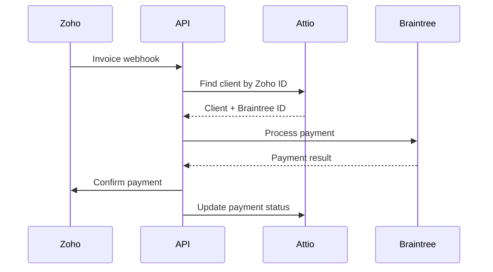

# System Patterns

## Architecture Overview

The Attio Integration API uses a modular service-oriented architecture designed to act as a bridge between Attio CRM, Zoho, and Braintree. The system avoids maintaining its own database, instead leveraging Attio objects as the source of truth. A core feature is automating the entire subscription and payment lifecycle without manual intervention, using Braintree payment links instead of a custom checkout UI.

## Core Design Patterns

### 1. Service Layer Pattern

The application is structured around service modules that encapsulate interactions with each external system:

- `zohoService.js` - Handles all Zoho API operations
- `attioService.js` - Manages Attio API operations
- `braintreeService.js` - Manages Braintree payment operations and payment link generation

These services abstract the complexity of integrating with each platform, providing a clean interface for the rest of the application.

### 2. Webhook Observer Pattern

The system implements an observer pattern through webhooks:

- External systems (Attio, Zoho, Braintree) act as subjects
- Our API acts as the observer, receiving notifications of events
- Event handlers process updates and propagate changes to other systems

### 3. Bidirectional Data Flow Pattern

The system implements a bidirectional flow where:

- Customer data originates in Attio
- Customer/subscription creation flows to Zoho via our API
- Invoices originate in Zoho and trigger payments in Braintree via our API
- Payment confirmations flow back to Zoho via our API
- All customer IDs (Zoho, Braintree) are stored in Attio

### 4. Event-Driven Architecture

The system operates on an event-driven model:

- Webhook events trigger specific workflows
- Each event type has a dedicated handler
- State changes propagate through the system based on events

### 5. Third-Party Payment Flow

- Braintree payment links handle the payment collection
- No custom checkout UI to maintain
- Secure payment processing through Braintree's hosted environment
- Webhook-based notification when payment is complete

## Component Relationships

### Route Layer

- Exposes webhook endpoints for each integrated system
- Validates incoming requests
- Routes events to appropriate service handlers

### Service Layer

- Encapsulates business logic for each integration
- Manages API authentication and communication
- Transforms data between system formats
- Handles automated customer and subscription creation
- Generates payment links via Braintree API

### Utility Layer

- Provides shared functionality (logging, auth verification, etc.)
- Ensures consistent error handling and security

## Technical Decisions

### 1. No Database Approach

Decision to use Attio objects as the primary data store instead of maintaining a separate database:

- **Pros**: Simplified architecture, reduced infrastructure, single source of truth
- **Cons**: Dependency on Attio API availability, potential performance constraints
- **Mitigation**: Implement request retries and circuit breakers for API resilience

### 2. Webhook-First Integration

Using webhooks as the primary integration mechanism for real-time updates:

- **Pros**: Near real-time data updates, reduced polling overhead
- **Cons**: Requires handling webhook delivery failures, verification complexity
- **Mitigation**: Implement webhook signature verification and delivery confirmation

### 3. Serverless Deployment

Using Render.com for serverless deployment:

- **Pros**: Simplified infrastructure, auto-scaling, reduced maintenance
- **Cons**: Cold start latency, execution time limits
- **Mitigation**: Optimize code for quick startup, implement background processes for long-running tasks

### 4. Braintree Payment Links

Using Braintree payment links instead of a custom checkout UI:

- **Pros**: No UI development or maintenance needed, PCI compliance handled by Braintree, seamless user experience
- **Cons**: Less customization of the payment experience, dependency on Braintree's link functionality
- **Mitigation**: Clear communication about payment process in email templates, fallback methods if needed

## Automation Workflows

### 1. Customer Subscription Initiation

### 2. Invoice Payment Processing

## Error Handling Strategy

- All API calls implement retry logic with exponential backoff
- Webhook processing failures are logged and can be manually retried
- Critical errors trigger alerts to the development team
- Failed payments have a specific recovery workflow
- System maintains transaction logs for reconciliation

This architecture provides a flexible foundation that can adapt to changes in any of the integrated systems while maintaining reliable data flow and synchronization, with a focus on full automation of the subscription and payment lifecycle.
