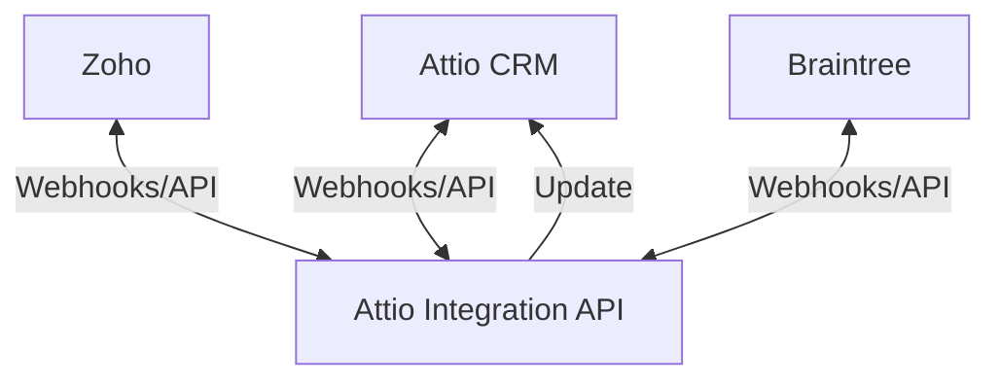

# System Patterns

## Architecture Overview

The Attio Integration API uses a modular service-oriented architecture designed to act as a bridge between Attio CRM, Zoho, and Braintree. The system avoids maintaining its own database, instead leveraging Attio objects as the source of truth.

## Core Design Patterns

### 1. Service Layer Pattern

The application is structured around service modules that encapsulate interactions with each external system:

- `zohoService.js` - Handles all Zoho API operations
- `attioService.js` - Manages Attio API operations
- `braintreeService.js` - Manages Braintree payment operations

These services abstract the complexity of integrating with each platform, providing a clean interface for the rest of the application.

### 2. Webhook Observer Pattern

The system implements an observer pattern through webhooks:

- External systems (Attio, Zoho, Braintree) act as subjects
- Our API acts as the observer, receiving notifications of events
- Event handlers process updates and propagate changes to other systems

### 3. Data Synchronization Pattern

A unidirectional sync pattern is used for service data:

- Zoho is the source of truth for service offerings
- Service data flows from Zoho -> Attio (never the reverse)
- Changes in Zoho trigger updates to corresponding Attio objects

### 4. Event-Driven Architecture

The system operates on an event-driven model:

- Webhook events trigger specific workflows
- Each event type has a dedicated handler
- State changes propagate through the system based on events

## Component Relationships

### Route Layer

- Exposes webhook endpoints for each integrated system
- Validates incoming requests
- Routes events to appropriate service handlers

### Service Layer

- Encapsulates business logic for each integration
- Manages API authentication and communication
- Transforms data between system formats

### Utility Layer

- Provides shared functionality (logging, auth verification, etc.)
- Ensures consistent error handling and security

## Technical Decisions

### 1. No Database Approach

Decision to use Attio objects as the primary data store instead of maintaining a separate database:

- **Pros**: Simplified architecture, reduced infrastructure, single source of truth
- **Cons**: Dependency on Attio API availability, potential performance constraints
- **Mitigation**: Implement request retries and circuit breakers for API resilience

### 2. Webhook-First Integration

Using webhooks as the primary integration mechanism for real-time updates:

- **Pros**: Near real-time data updates, reduced polling overhead
- **Cons**: Requires handling webhook delivery failures, verification complexity
- **Mitigation**: Implement webhook signature verification and delivery confirmation

### 3. Serverless Deployment

Using Render.com for serverless deployment:

- **Pros**: Simplified infrastructure, auto-scaling, reduced maintenance
- **Cons**: Cold start latency, execution time limits
- **Mitigation**: Optimize code for quick startup, implement background processes for long-running tasks

## Error Handling Strategy

- All API calls implement retry logic with exponential backoff
- Webhook processing failures are logged and can be manually retried
- Critical errors trigger alerts to the development team

This architecture provides a flexible foundation that can adapt to changes in any of the integrated systems while maintaining reliable data flow and synchronization.
